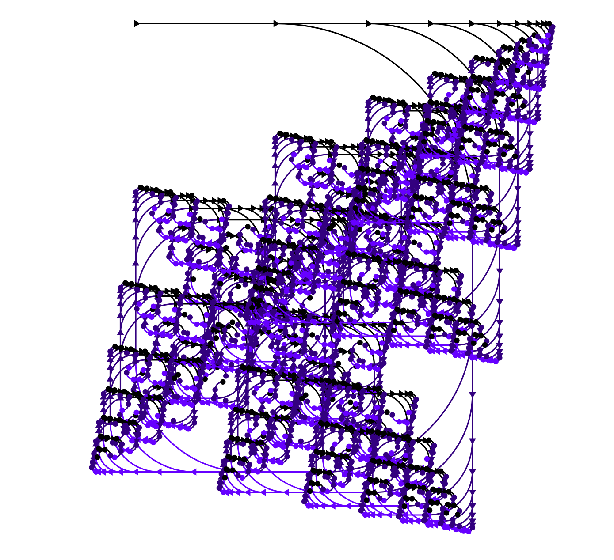

.. Fractalang documentation master file, created by
   sphinx-quickstart on Thu Mar 31 21:36:45 2022.
   You can adapt this file completely to your liking, but it should at least
   contain the root `toctree` directive.

Gallery
=======

   Ocean

   Darts

.. figure:: gallery/dance.png

   Dance

   String

.. figure:: gallery/roulette.png

   Roulette

   Fern

   Vineyard

.. figure:: gallery/snakes.png

   Snakes

   Atomic snow

   Trefl
