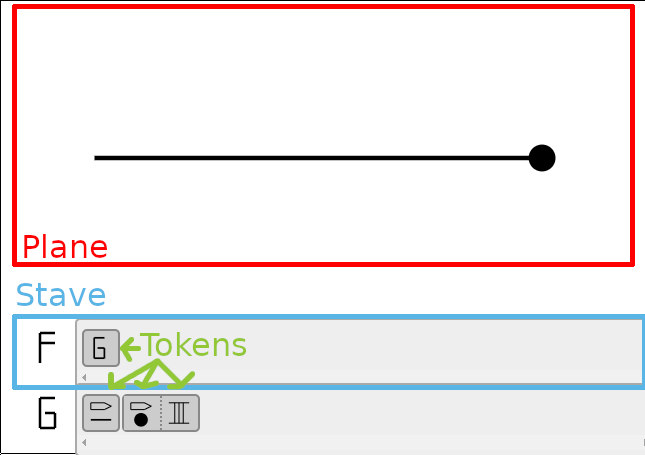

Definitions
===========

Before we start, we should describe basic terms.

   Definitions

Editor
  A program / GUI to make fractals.

Plane
  An rendered image.

Token
  An atom of fractalang - in editor it's a block with symbol.

  Token can describes numbers, colors or executing action like drawing or rotating.

  Token is a *word* in fractalang. Like a *word* - token connected with another tokens
  can creates sentences which making nice figures or fractals.

Stave
  Stave like in music notation which is

Action
  Token with action/command/order. Examples are drawing line (:tut:token:`DRAW_LINE`) or rotating (:tut:token:`ROTATE_LEFT` or :tut:token:`ROTATE_RIGHT`)

Value
  Token with specified value - often a number (e.g. Three :tut:token:`COUNT_3`), fractions (e.g. One third :tut:token:`FRACT_1_3`) but it could be as color or stroke width.
